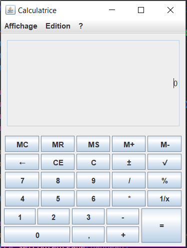
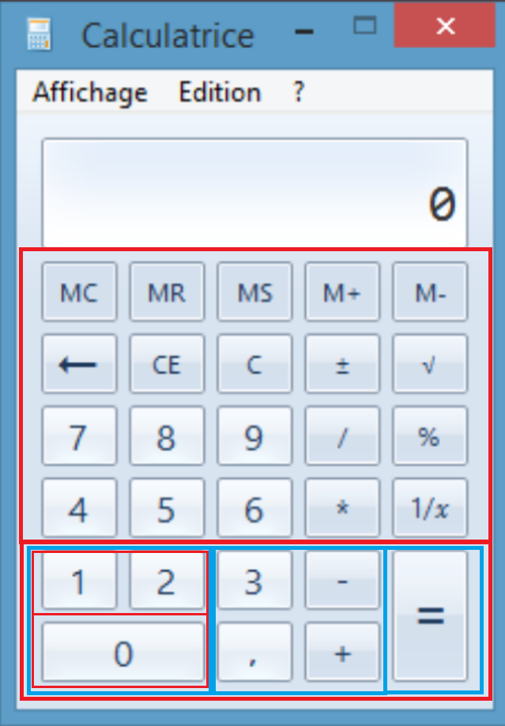

# Calculatrice – IHM (interface sans interaction)

Petit projet pour le module **IHM** : reproduction de l’interface de la calculatrice Windows en **Java Swing**(JFrame, JPanel, JMenuBar, JTextField, BoxLayout, GridLayout…).

> Il s’agit uniquement de **l’interface graphique** :  
> aucun calcul n’est encore implémenté.

---

## Aperçu de l’interface

Voici le rendu final de la calculatrice :



---

## Organisation des layouts (Nested Layouts)

Pour construire la zone des boutons, j’ai utilisé des **layouts imbriqués** (nested layouts).  
Ce schéma montre comment les différents panneaux s’organisent :



### 🔴 Rouge = Layout vertical (BoxLayout.PAGE_AXIS)

Les blocs rouges représentent les panneaux organisés **verticalement**, c’est-à-dire que les sous-éléments s’empilent du haut vers le bas.  
Exemple :  
- les 4 premières lignes de boutons (MC → 1/x)  
- et dans le bloc du bas : le sous-bloc de gauche contenant (1,2) puis (0)

### 🔵 Bleu = Layout horizontal (BoxLayout.LINE_AXIS)

Les blocs bleus représentent les panneaux organisés **horizontalement**, où les sous-éléments se placent les uns à côté des autres.  
Exemple :  
- le bloc du bas complet est un `BoxLayout` horizontal  
- le milieu du bas (3, -, ,, +) forme une grille 2×2 dans une rangée horizontale

Grâce à cette organisation rouge/bleu, chaque partie de l’interface reste alignée et structurée sans utiliser de `setBounds`.

---

### Détail des layouts utilisés

- Les 4 premières lignes utilisent **GridLayout(1,5)**.
- Le bloc du bas combine :
  - un `BoxLayout` horizontal (niveau principal),
  - un `BoxLayout` vertical pour le bloc gauche (1/2 puis 0),
  - un `GridLayout(2,2)` pour le bloc milieu,
  - un panneau vertical/grille simple pour étendre “=”.

Cette structure permet de respecter la forme générale de la vraie calculatrice Windows.


---

## Technologies utilisées

- **Java (JDK 8+)**
- **Swing**
  - `JFrame`, `JPanel`, `JMenuBar`, `JMenu`
  - `JTextField`
  - `JButton`
  - `GridLayout`, `BoxLayout`, `BorderLayout`
  - `Box.createRigidArea` pour ajouter des petits espaces

---

## Organisation de l’interface

Le code est dans une seule classe : **`App`** avec une méthode `main`.

Principaux éléments :

- **Barre de menu** : `Affichage`, `Edition`, `?`
- **Zone d’affichage** : un `JTextField` aligné à droite, non éditable
- **Bloc de boutons principal** :
  - 4 lignes de 5 boutons (`MC`, `MR`, `MS`, `M+`, `M-`, `←`, `CE`, …)  
    → chaque ligne est un `JPanel` avec `new GridLayout(1,5, hGap, vGap)`
- **Bloc du bas** (partie en bleu sur le schéma) :
  - `blockBas` : `BoxLayout` horizontal
  - `blockGauche` : `BoxLayout` vertical avec :
    - en haut : `1` et `2` dans une grille 1×2
    - en bas : `0` sur toute la largeur
  - `blockMilieu` : `GridLayout(2,2)` avec `3`, `-`, `,`, `+`
  - `blockDroite` : panneau contenant uniquement le bouton `=`

L’idée principale est d’utiliser des **layouts imbriqués** au lieu de positionner les boutons à la main.

---

## Comment exécuter

1. Cloner le dépôt :
   ```bash
   git clone https://github.com/Amir-Bitam/java-calculatrice-ihm
   cd java-calculatrice-ihm
   ```
2. Compiler :
   ```bash
   javac src/App.java
   ```
3. Lancer :
   ```bash
   java App
   ```
   Ou simplement ouvrir le projet dans votre IDE et exécuter la classe App.

  ## Auteur
  - Amir-Bitam


